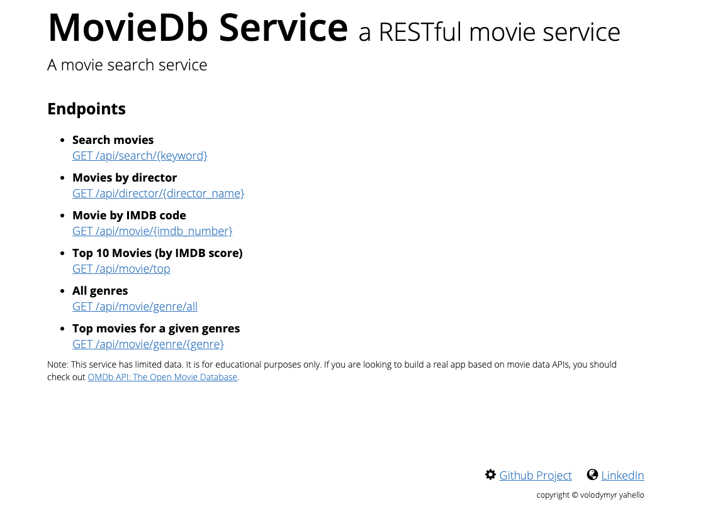

[](https://www.python.org/)
[](https://github.com/psf/black)
[](https://www.pylint.org)
[](http://flake8.pycqa.org/)
[](http://mypy-lang.org/)
[](https://travis-ci.org/vyahello/movie-search-api)
[](LICENSE.md)

# Movie searcher
> A lightweight movie search service written in [responder](http://python-responder.org/en/latest/) python HTTP service framework. 
> Please follow https://movie-search-rest-api.herokuapp.com link app to see how it looks like.

## Tools/features

### Production
- python 3.7
- responder framework
- vue js framework
- nginx
- docker 
- heroku deployment

### Development
- pytest framework
- travis & github CI

## Usage

### Frontend


> The page could be accessed via `http://0.0.0.0:7777/index.html` endpoint.

### Backend (API docs)



> The page could be accessed via `http://0.0.0.0:7777/api` endpoint.

#### Docker

Docker setup is based on docker-compose which consists of 3 official docker images:
- vyahello/movie-searcher-base
- vyahello/movie-searcher-backend  
- vyahello/movie-searcher-frontend

Please run the following command to launch an application via docker-compose (it uses [docker-compose.yml](docker-compose.yml) file):
```docker
cd docker && docker-compose up
```

#### Source code

Please run next commands to start an app via source code:
```bash
git clone git@github.com:vyahello/movie-search-api.git
pip install -r requirements.txt
python movie_searcher.py
```

## Development notes

### Code analysis
In general static code analysis consists of following tools: `black`, `flake8`, `pylint`, `mypy`, and `unittests` accordingly.
To be able to start static code analysis _locally_ please run following script from the root directory of the project:
```bash
./run-code-analysis.sh install-dependencies
```

### Deployment
Please refer to [deployment](DEPLOYMENT.md) page to get instructions on how to provision an app.

### Release notes
Please refer to [changelog](CHANGELOG.md) page for app release notes.

## Meta
Author – _Volodymyr Yahello_.

Distributed under the `MIT` license. See [license](LICENSE.md) for more information.

You can reach out me at:
* [vyahello@gmail.com](vyahello@gmail.com)
* [https://twitter.com/vyahello](https://twitter.com/vyahello)
* [https://www.linkedin.com/in/volodymyr-yahello-821746127](https://www.linkedin.com/in/volodymyr-yahello-821746127)

### Contributing
I would highly appreciate any contribution and support. If you are interested to add your ideas into project please follow next simple steps:

1. Clone the repository
2. Configure `git` for the first time after cloning with your `name` and `email`
3. `pip install -r requirements.txt` to install all project dependencies
4. `pip install -r requirements-dev.txt` to install all development project dependencies
5. Create your feature branch (`git checkout -b feature/fooBar`)
6. Commit your changes (`git commit -am 'Add some fooBar'`)
7. Push to the branch (`git push origin feature/fooBar`)
8. Create a new Pull Request
